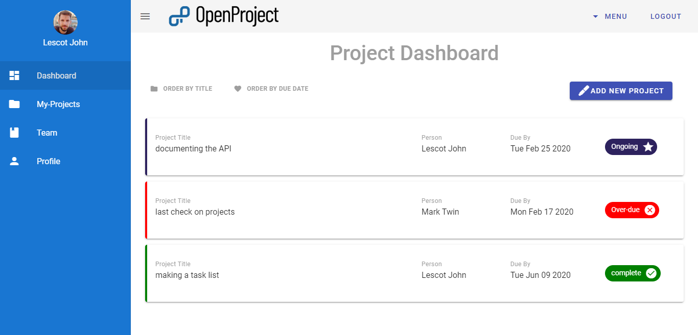
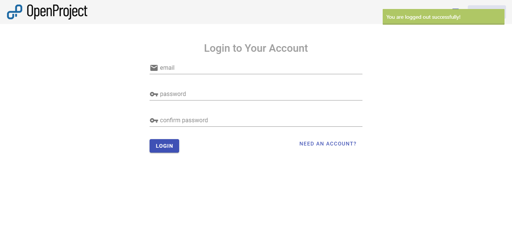
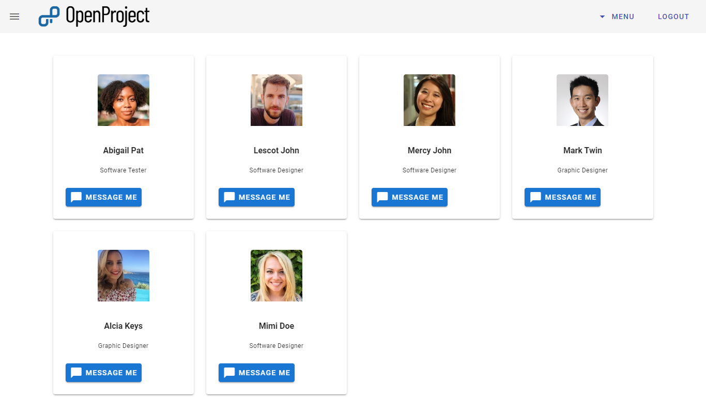
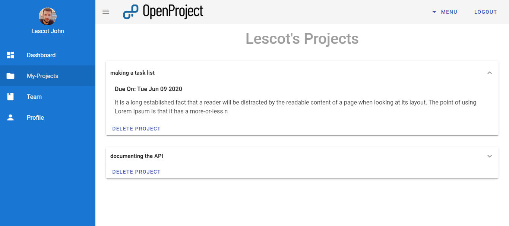
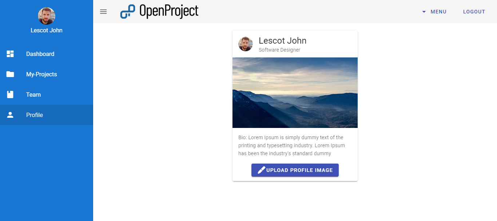

# Fullstack Project Management Application

Check the app [Here](https://open-project-manager.herokuapp.com)

### Technologies Used To Build The App

- Node.js
- MongoDB
- Express
- Vue.js

### App Description

This is an application where user can register, create a project and set timeline to finish the project. The application help users keep track of their projects

### App Usage

Rename `/config/config.env.env` to `/config/config.env` and fill in all the environmental variable.

Run

```
npm install
```

and

```
npm run dev
```

### App Views

**Dashboard**


**Login**


**teams**


**projects**


**profile**

